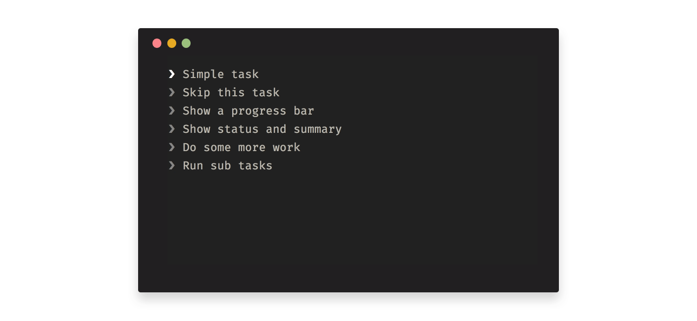

# @hjvedvik/tasks

> This package share many similarities with [listr](https://github.com/SamVerschueren/listr), but is more suited for synchronous code.



### Install

```bash
npm install @hjvedvik/tasks
```

### Usage

```js
const Tasks = require('@hjvedvik/tasks')

const tasks = new Tasks([
  {
    title: 'Simple task',
    task: (context, task) => {
      // task.setProgress(1, 5)
      // task.setStatus('')
      // task.setSummary('')
      // task.fail('')
    }
  }
])

tasks.run({
  // context
})
```
